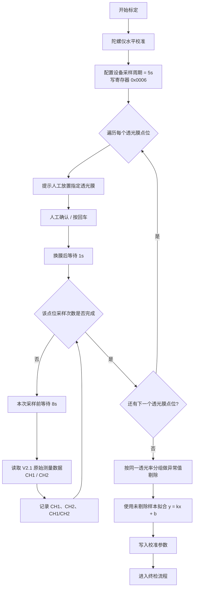
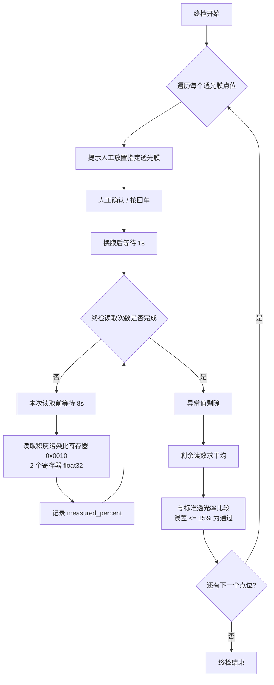

# 运行程序

```powershell
.\.venv\Scripts\python.exe main.py --port COM6 --address 1
```

## calibration_plan.csv 格式

推荐格式：

```csv
transmittance_percent,samples_per_point,verification_samples_per_point
100,5,5
99,5,5
97,5,5
91.4,5,5
85,5,5
72.4,5,5
```

- `samples_per_point`：标定阶段每个透光率点位的采样次数。
- `verification_samples_per_point`：终检阶段每个透光率点位的读取次数。
- 如果 CSV 没有 `verification_samples_per_point`，程序会使用命令行 `--verification-samples`，默认 5。

## 可选参数

调整标定采样异常剔除灵敏度：

```powershell
.\.venv\Scripts\python.exe main.py --port COM6 --address 1 --outlier-z-threshold 3.5
```

调整 CSV 未配置时的终检默认读取次数，或调整终检异常剔除灵敏度：

```powershell
.\.venv\Scripts\python.exe main.py --port COM6 --address 1 --verification-samples 5 --verification-outlier-z-threshold 3.5
```

校准完成一段时间后，如果只需要按终检流程做复检，可以在启动后的提示中选择跳过校准流程；非交互运行时使用：

```powershell
.\.venv\Scripts\python.exe main.py --port COM6 --address 1 --recheck-only --non-interactive
```

## 输出位置

程序会在 `output` 下按时间创建本次运行文件夹，例如：

```text
output/20260430_142501/
```

该目录中会保存：

- `calibration_samples.csv`：全部标定采样结果，包含 `used_for_fit` 和 `outlier_reason`。
- `calibration_fit.svg`：拟合图，蓝点为参与拟合样本，红色叉号为剔除样本，橙色菱形为终检平均结果。
- `calibration_parameters.csv`：最终确认后的 `k/b/A1/A2`。
- `verification_results.csv`：终检每次读数、是否参与平均、剔除原因、平均值和判定结果。
- `verification_results.svg`：终检结果图，显示标准值、平均测量值、理想线和容差线。
- `reinspection_results.csv`：仅复检运行时生成，字段和判定逻辑与终检一致，用于和校准后的终检结果区分。
- `reinspection_results.svg`：复检结果图，格式和终检结果图一致。

## 终检说明

终检读取次数优先来自 `calibration_plan.csv` 的 `verification_samples_per_point`。程序会先剔除偏差过大的读数，再用剩余读数平均值进行 `±5%` 判定。

## 复检说明

复检用于已完成校准后的后续检查。复检会跳过陀螺仪校准、采样周期配置、标定采样、拟合和参数写入，只执行与终检一致的透光膜逐点读取、异常剔除、平均和 `±5%` 判定，并输出到 `reinspection_results.csv` 和 `reinspection_results.svg`。

## 安装虚拟环境

```powershell
cd 积灰标定
py -3.7 -m venv .venv
.\.venv\Scripts\python.exe -m pip install --no-index --find-links .\wheelhouse -r requirements.txt
.\.venv\Scripts\python.exe main.py --port COM6 --address 1
```
## 标定采样流程图



## 终检流程图



# 遗留问题

换膜后第一个稳定原始 CH1/CH2 需要几个设备采样周期？原始测量命令返回的是实时值、上一周期缓存值，还是滤波后的历史值？ 
